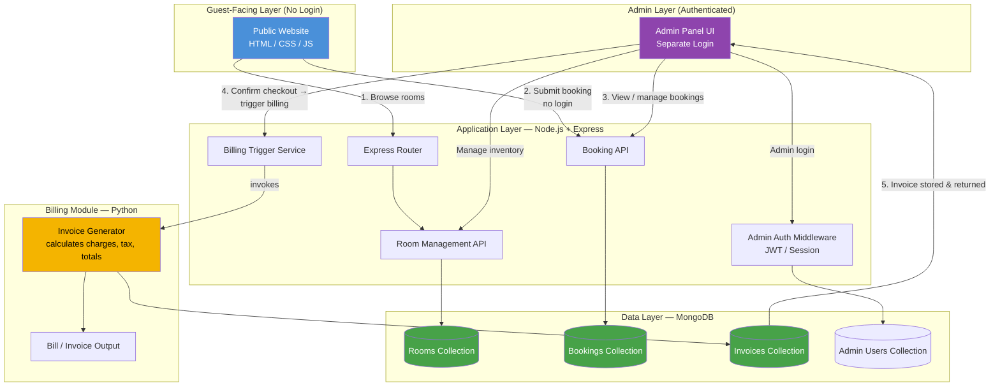
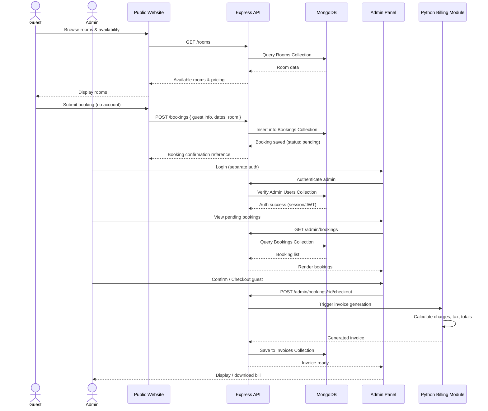

# 🏨 Royal Stay — Hotel Management System (HMS)

> A full-stack web application spanning the hotel's public-facing web presence (room browsing & booking) to a secure backend admin panel for complete hotel operations control.


---

## 📖 Table of Contents

- [Problem Statement](#-problem-statement)
- [Solution Overview](#-solution-overview)
- [Key Features](#-key-features)
- [System Architecture](#-system-architecture)
- [Data Flow Diagram](#-data-flow-diagram)
- [Booking → Billing Data Pipeline](#-booking--billing-data-pipeline)
- [Tech Stack](#-tech-stack)
- [Project Structure](#-project-structure)
- [Getting Started](#-getting-started)
- [Configuration](#-configuration)
- [Usage](#-usage)
- [Roles & Access Control](#-roles--access-control)
- [Roadmap](#-roadmap)
- [Contributing](#-contributing)
- [License](#-license)
- [Author](#-author)

---

## 🧩 Problem Statement

Small and mid-sized hotels often juggle disconnected tools to run day-to-day operations:

- **No unified online presence.** Guests can't view rooms, amenities, or availability without calling the front desk.
- **Manual, error-prone booking logs.** Bookings tracked in spreadsheets or paper registers lead to double-bookings and lost records.
- **No centralized admin control.** Staff have no single dashboard to manage rooms, bookings, guests, and revenue.
- **Billing is disconnected from bookings.** Invoices are generated manually after the fact, increasing the chance of pricing errors and delays.
- **Friction for guests.** Requiring account creation just to check room availability or make a booking discourages casual visitors.

**Royal Stay HMS** solves this with a public website where guests can browse rooms and book **without creating an account**, backed by a dedicated **admin panel** where hotel staff manage rooms, confirm/track bookings, and trigger **automated billing & invoice generation**.

---

## 💡 Solution Overview

1. **Guests** visit the public site, browse available rooms/rates, and submit a booking request — **no login required**.
2. The **Express API** validates the request and stores it in **MongoDB**.
3. **Admin staff** log into a separate, authenticated **Admin Panel** to view incoming bookings, manage room inventory, and confirm/reject/check-in/check-out guests.
4. On confirmation/checkout, a **Python billing module** generates the invoice (calculating room charges, duration, taxes, add-ons) and produces a bill for the guest.
5. All operational data (rooms, bookings, billing records) is persisted centrally in MongoDB, giving the admin a single source of truth for hotel operations.

---

## ✨ Key Features

**Guest-facing website (public, no login):**
- 🛏️ Browse room types, availability, pricing, and amenities
- 📅 Submit booking requests (check-in/check-out dates, room type, guest details)
- 📱 Responsive design for desktop & mobile

**Admin Panel (authenticated, separate from public site):**
- 🔐 Secure admin login, isolated from the guest-facing flow
- 📋 View, confirm, modify, or cancel bookings
- 🏨 Manage room inventory (add/edit/remove room types, update availability & pricing)
- 👥 Track guest/booking records
- 🧾 Trigger automated **billing & invoice generation** (Python module) on checkout
- 📊 Operational overview of occupancy and bookings

---

## 🏗️ System Architecture



**Layer breakdown:**

| Layer | Responsibility |
|---|---|
| **Guest-Facing Website** | Public, unauthenticated browsing of rooms and booking submission |
| **Admin Panel** | Separate, authenticated interface for staff to manage bookings, rooms, and billing |
| **Application (Node.js + Express)** | REST API layer routing requests to booking, room, and billing services; auth middleware protects admin-only routes |
| **Billing Module (Python)** | Independent module invoked on checkout/confirmation to calculate charges and generate the invoice |
| **Data Layer (MongoDB)** | Stores rooms, bookings, invoices, and admin accounts as separate collections |

---

## 🔄 Data Flow Diagram



---

## 🧾 Booking → Billing Data Pipeline

The end-to-end journey of a single booking, from guest submission to final invoice:

```mermaid
flowchart LR
    A[Guest submits booking<br/>no login] --> B[Booking stored in MongoDB<br/>status: pending]
    B --> C[Admin reviews booking<br/>in Admin Panel]
    C --> D{Admin decision}
    D -->|Confirm| E[Booking status → confirmed<br/>room marked reserved]
    D -->|Reject| F[Booking status → cancelled]
    E --> G[Guest checks in / stays]
    G --> H[Admin triggers checkout]
    H --> I[Python Billing Module invoked]
    I --> J[Calculate: room rate × nights<br/>+ taxes + add-ons]
    J --> K[Invoice document generated]
    K --> L[Invoice saved to Invoices Collection]
    L --> M[Bill presented to guest /<br/>available to Admin]

    style A fill:#4a90d9,color:#fff
    style I fill:#f4b400,color:#000
    style L fill:#47A248,color:#fff
    style M fill:#8e44ad,color:#fff
```



**Pipeline stages explained:**

1. **Intake** – Guest submits booking details (name, contact, room type, check-in/out dates) through the public site with no account required.
2. **Persistence** – Express API validates and writes the booking into MongoDB's `Bookings` collection with a `pending` status.
3. **Admin Review** – Staff review pending bookings in the Admin Panel and confirm or reject based on room availability.
4. **Room Locking** – On confirmation, the corresponding room's availability is updated in the `Rooms` collection to prevent double-booking.
5. **Checkout Trigger** – When the guest checks out (or booking is marked complete), the admin panel calls the billing trigger endpoint.
6. **Billing Computation (Python)** – The Python module calculates total charges (room rate × number of nights, taxes, any additional services) and generates the invoice.
7. **Invoice Storage** – The generated invoice is persisted in the `Invoices` collection, linked to the originating booking.
8. **Delivery** – The final bill is made available to the admin (and optionally the guest) for record-keeping or download.

---

## 🧰 Tech Stack

| Category | Technology |
|---|---|
| **Backend / API** | Node.js, Express.js |
| **Database** | MongoDB (Mongoose ODM) |
| **Billing Engine** | Python (invoice/bill calculation & generation) |
| **Frontend** | HTML5, CSS3, JavaScript |
| **Authentication** | Admin-only auth (session/JWT-based); guest checkout requires no account |
| **Environment** | Node `.env` config, Python virtual environment for the billing script |

> Update this table with exact package names/versions from your `package.json` and Python `requirements.txt`.

---

## 📂 Project Structure

```
Royal-Stay-HMS/
└── Royal stay/
    ├── public/                 # Static assets (CSS, JS, images) for guest site
    ├── views/                  # HTML/EJS templates (guest site + admin panel)
    ├── admin/                  # Admin panel routes, views & controllers
    ├── routes/                 # Express route definitions (rooms, bookings, admin)
    ├── models/                 # Mongoose schemas (Room, Booking, Invoice, Admin)
    ├── billing/                # Python billing & invoice generation module
    │   ├── invoice_generator.py
    │   └── requirements.txt
    ├── server.js               # Express app entry point
    ├── package.json
    └── README.md
```

> 📝 Adjust this tree to match the real file/folder names inside `Royal stay/`.

---

## 🚀 Getting Started

### Prerequisites

- Node.js 18+ and npm
- MongoDB (local instance or MongoDB Atlas)
- Python 3.9+ (for the billing module)

### Installation

```bash
# 1. Clone the repository
git clone https://github.com/SM649/Royal-Stay-HMS.git
cd "Royal-Stay-HMS/Royal stay"

# 2. Install Node.js dependencies
npm install

# 3. Set up the Python billing environment
cd billing
python -m venv venv
source venv/bin/activate      # On Windows: venv\Scripts\activate
pip install -r requirements.txt
cd ..

# 4. Configure environment variables (see below)

# 5. Start the server
npm start
```

The app will be available at `http://localhost:3000/` (guest site) and `http://localhost:3000/admin` (admin panel) — adjust to your actual routes/port.

---

## ⚙️ Configuration

Create a `.env` file in the project root:

```env
PORT=3000
MONGODB_URI=mongodb://localhost:27017/royalstay
ADMIN_SESSION_SECRET=your_session_secret_here
```

> 🔒 Never commit `.env` or database credentials to version control. Add `.env` to `.gitignore`.

---

## ▶️ Usage

**As a guest:**
1. Visit the homepage and browse available rooms.
2. Select a room, pick check-in/check-out dates, and submit the booking form — no sign-up needed.
3. Receive a booking reference/confirmation.

**As an admin:**
1. Navigate to the admin panel and log in with admin credentials.
2. Review pending bookings and confirm or reject them.
3. Manage room inventory (add rooms, update pricing/availability).
4. On guest checkout, trigger invoice generation and download/view the bill.

---

## 🔐 Roles & Access Control

| Role | Access |
|---|---|
| **Guest** | Public website only — browse rooms & submit bookings. **No account/login required.** |
| **Admin** | Separate, authenticated **Admin Panel** — full control over bookings, rooms, and billing. |

> There is intentionally **no guest login system** — bookings are tracked by reference/contact details rather than user accounts, keeping the guest flow frictionless.

---

## 🗺️ Roadmap

- [ ] Email/SMS booking confirmations for guests
- [ ] Online payment gateway integration
- [ ] Guest self-service booking lookup (by reference number, still no account)
- [ ] Admin dashboard analytics (occupancy rate, revenue trends)
- [ ] Automated PDF invoice download/email
- [ ] Role-based admin permissions (manager vs. front-desk staff)
- [ ] Deployment pipeline (Docker + CI/CD)

---

## 🤝 Contributing

Contributions are welcome!

1. Fork the repo
2. Create a feature branch: `git checkout -b feature/your-feature`
3. Commit your changes: `git commit -m "Add your feature"`
4. Push to the branch: `git push origin feature/your-feature`
5. Open a Pull Request

---

## 📄 License

This project is licensed under the **MIT License** — see the [LICENSE](LICENSE) file for details.

---

## 👤 Author

**SM649**
Royal Stay — Hotel Management System

⭐ If you found this project useful, consider giving it a star on GitHub!
